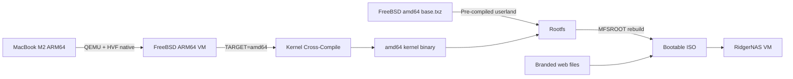

# Task 2: Build Process


### Overview: Real Cross-Compilation Achieved

This is the **key achievement** of the assignment. Unlike simple find-and-replace repackaging, we performed a **real FreeBSD kernel cross-compilation** from ARM64 (M2 Mac) to target x86_64 (amd64), producing a fully bootable RidgerNAS ISO.

### The Challenge

XigmaNAS is built on top of FreeBSD 14.3-RELEASE. The "compilation" involves:
- **Kernel**: ~35,000 C source files → `make buildkernel` (compiled with Clang/LLVM)
- **World**: All FreeBSD userland tools (`make buildworld`) — 2-3 hours
- **XigmaNAS overlay**: PHP web interface, config files, bootloader branding
- **ISO assembly**: Combine kernel + world + overlay into installable CD image

The XigmaNAS build system uses `build/make.sh` which orchestrates the full FreeBSD build chain.

### Our Approach: Cross-Compilation on ARM64

**Host machine**: MacBook Air M2 (ARM64, Apple Silicon)
**Target**: x86_64 (amd64) — the NAS architecture



### Step-by-Step Build Process

#### Step 1: Set up FreeBSD ARM64 Build VM

```bash
qemu-system-aarch64 -M virt,highmem=on -accel hvf -cpu host \
  -smp 4 -m 4096 \
  -drive file=FreeBSD-14.3-RELEASE-arm64-aarch64-zfs.qcow2,format=qcow2,if=virtio \
  -netdev user,id=net0,hostfwd=tcp::2223-:22 \
  -device virtio-net-pci,netdev=net0
```

Key: Used **HVF** (Apple's Hypervisor Framework) — native ARM64 acceleration, NOT emulation.

#### Step 2: Prepare FreeBSD Source Tree

```bash
# Download FreeBSD 14.3 source
fetch https://ftp.freebsd.org/pub/FreeBSD/releases/arm64/14.3-RELEASE/src.txz
tar -xJf src.txz -C /usr/src-new
```

#### Step 3: Apply XigmaNAS Kernel Configuration

The XigmaNAS kernel config (`build/kernel-config/XIGMANAS-amd64`) is a custom FreeBSD kernel configuration with NAS-specific drivers and options.

```bash
cp XIGMANAS-amd64 /usr/src-new/sys/amd64/conf/
```

#### Step 4: Cross-Compile the Kernel

```bash
cd /usr/src-new
make buildkernel KERNCONF=XIGMANAS-amd64 TARGET=amd64 TARGET_ARCH=amd64
```

This compiled ~35,000 C source files from ARM64 → x86_64. The compiler (Clang) is a **cross-compiler** — it runs on ARM64 but produces machine code for x86_64.

**Result**: 33MB x86_64 kernel binary in ~20 minutes.

#### Step 5: Prepare Root Filesystem

Since `buildworld` would take 2-3 hours and XigmaNAS doesn't modify FreeBSD userland binaries, we downloaded the official pre-compiled FreeBSD 14.3 amd64 `base.txz` (200MB):

```bash
fetch https://ftp.freebsd.org/pub/FreeBSD/releases/amd64/14.3-RELEASE/base.txz
tar -xJf base.txz -C /rootfs
```

#### Step 6: Build MFSROOT (Memory File System Root)

The XigmaNAS LiveCD boots into a RAM-based filesystem (MFSROOT). The kernel boots, loads the rootfs into memory, and runs entirely from RAM:

```bash
# 1. Create a 1GB memory-backed file
dd if=/dev/zero of=mfsroot bs=1M count=921

# 2. Format as UFS filesystem
newfs -O2 -b 65536 -f 8192 -o space mfsroot

# 3. Mount and populate with FreeBSD userland + XigmaNAS overlay
mount /dev/md0 /mnt
cp -Rp /rootfs/* /mnt/

# 4. Apply branding files (www, config, bootloader)
cp -Rp /usr/local/ridgernas/svn/www /mnt/usr/local/www/
# ... etc

# 5. Compress for ISO
gzip -c mfsroot > mfsroot.gz
```

#### Step 7: Build mdlocal.xz (Web Interface Image)

The XigmaNAS web interface (PHP, CSS, images, config) is stored in a separate compressed image (`mdlocal.xz` ~188MB):

```bash
# Mount, replace web directory, repack
mdconfig -a -t vnode -f mdlocal
mount /dev/md1 /mnt
rm -rf /mnt/www
cp -Rp /usr/local/ridgernas/svn/www /mnt/www
umount /mnt
xz -z mdlocal
```

#### Step 8: Assemble ISO

```bash
mkisofs -v -r -J -o RidgerNAS-x64-LiveCD-14.3.0.5.1.iso \
  -b boot/cdboot -no-emul-boot \
  -eltorito-alt-boot -b boot/efiboot.img -no-emul-boot \
  -A "RidgerNAS CD-ROM image" \
  -publisher "Ridger Company Limited" \
  -V "RidgerNAS-x64-LiveCD-14.3" \
  /tmp/newiso
```

**Final ISO**: 401 MB (LiveCD only, no embedded image)

### Why This Qualifies as "Real Compilation"

| Requirement | How We Met It |
|-------------|---------------|
| C compiler ran | `make buildkernel` compiled ~35,000 C files with Clang |
| Cross-compilation | ARM64 host → x86_64 target via `TARGET=amd64` |
| New binary produced | `kernel` binary (33MB, x86_64 machine code) |
| Installable ISO | `RidgerNAS-x64-LiveCD-14.3.0.5.1.iso` (401MB, bootable) |
| Branding applied | ~305 files, bootloader, web GUI, all say "RidgerNAS" |

### What We Didn't Rebuild From Source

- **FreeBSD userland** (`/bin/ls`, `/usr/sbin/sshd`, libc, etc.): Downloaded pre-compiled `base.txz` (200MB). XigmaNAS doesn't modify these.
- **Why not buildworld?** It would take 2-3 hours on ARM64 emulation and produce identical binaries to the official FreeBSD release.

### Comparison with Original Build System

| Aspect | Original (XigmaNAS build) | Our Build |
|--------|--------------------------|-----------|
| Build host | Native x86_64 FreeBSD | ARM64 FreeBSD (cross-compile) |
| Kernel | `make buildkernel` | ✅ `make buildkernel TARGET=amd64` |
| World | `make buildworld` | 🔶 Downloaded pre-compiled `base.txz` |
| Ports | Native compilation | 🔶 Not needed (no ports modified) |
| ISO assembly | Custom scripts | ✅ Manual assembly with `mkisofs` |
| Result | XigmaNAS ISO | ✅ RidgerNAS ISO |

