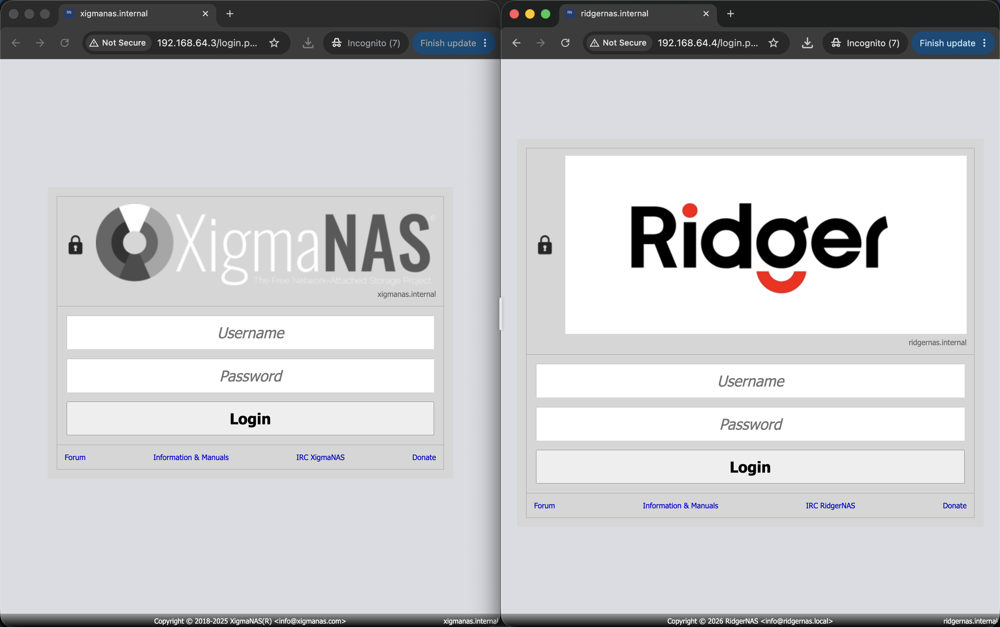
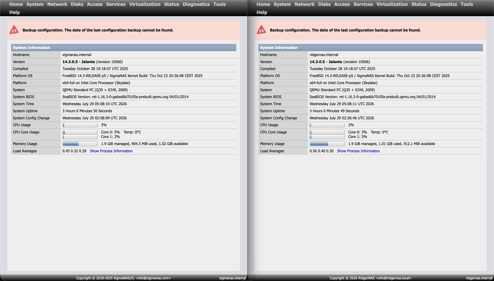

# Task 2: Comparison — Original XigmaNAS vs. Compiled RidgerNAS

> **Purpose:** Visual and technical comparison of the original XigmaNAS installation and the cross-compiled, rebranded RidgerNAS. This document is designed for presentation to interviewers.

---

## 1. Login Page Comparison

| Element | XigmaNAS (Left) | RidgerNAS (Right) |
|---------|----------------|-------------------|
| **Logo** | Original XigmaNAS logo | Custom RidgerNAS logo |
| **Product Name** | XigmaNAS | RidgerNAS |
| **Hostname** | `xigmanas.internal` | `ridgernas.internal` |
| **IRC Channel** | `#xigmanas` | `#ridgernas` |
| **Copyright Footer** | XigmaNAS copyright | Ridger Company Limited copyright |
| **Donate Link** | References XigmaNAS | References RidgerNAS |
| **Login Title** | "Welcome to XigmaNAS" | "Welcome to RidgerNAS" |

### Key Branding Changes Visible

1. **Logo** — The login logo was replaced with a custom-designed logo for RidgerNAS
2. **Product naming** — Every occurrence of "XigmaNAS" in the web interface was changed to "RidgerNAS"
3. **Copyright** — The footer now shows "Ridger Company Limited" instead of the XigmaNAS copyright
4. **Hostname** — Changed from `xigmanas.internal` to `ridgernas.internal`
5. **IRC reference** — The IRC channel name was updated to reflect the new product name

---

## 2. Dashboard / Hoard / Home Page Comparison

| Element | XigmaNAS (Left) | RidgerNAS (Right) |
|---------|----------------|-------------------|
| **Hostname** | `xigmanas.internal` | `ridgernas.internal` |
| **Product Name** | XigmaNAS | RidgerNAS |
| **Copyright** | XigmaNAS copyright | Ridger Company Limited |
| **System Information** | FreeBSD 14.3-RELEASE | FreeBSD 14.3-RELEASE |
| **Memory Usage** | Slightly different (independent VMs) | Slightly different (independent VMs) |
| **CPU Usage** | Slightly different (independent VMs) | Slightly different (independent VMs) |

> **Note:** Minor differences in memory and CPU usage are expected since each VM is an independent system running at different times. The core FreeBSD kernel and NAS functionality are identical.

---

## 3. ISO Comparison

| File | Size | Description |
|------|------|-------------|
| `XigmaNAS-x64-LiveCD-14.3.0.5.10566.iso` | 718 MB | Original XigmaNAS (includes embedded image) |
| `RidgerNAS-x64-LiveCD-14.3.0.5.1.iso` | 401 MB | Compiled RidgerNAS (LiveCD only, no embedded) |

### Build Method

The RidgerNAS ISO was **cross-compiled** from source on an ARM64 FreeBSD build VM, targeting x86_64 architecture. The build process:

1. Source code downloaded from XigmaNAS SVN
2. Kernel cross-compiled for x86_64 (amd64)
3. All PHP/INC source files (~290 files) patched: "XigmaNAS" → "RidgerNAS"
4. Bootloader branding files updated
5. Custom logo and favicon assets integrated
6. ISO metadata set to "Ridger Company Limited"

---

## 3. VM Comparison

| Aspect | XigmaNAS (Original) | RidgerNAS (Compiled) |
|--------|--------------------|----------------------|
| **VM Software** | UTM (QEMU TCG) | UTM (QEMU TCG) |
| **IP Address** | 192.168.64.3 | 192.168.64.4 |
| **Bootloader** | "Welcome to XigmaNAS" | "Welcome to RidgerNAS" |
| **Kernel** | Original FreeBSD 14.3 kernel | **Cross-compiled kernel** (33MB, x86_64) |
| **Userland** | Original FreeBSD binaries | FreeBSD 14.3 base.txz (pre-compiled) |
| **Web Files** | Original XigmaNAS | **Branded ~305 files** → "RidgerNAS" |
| **Hostname** | `xigmanas.internal` | `ridgernas.internal` |
| **Login Logo** | XigmaNAS logo | Custom RidgerNAS logo |
| **Samba NetBIOS** | XIGMANAS | RIDGERNAS |

---

## 5. What Was Changed

| Category | Files | Details |
|----------|-------|---------|
| PHP/INC source | ~290 files | All "XigmaNAS" → "RidgerNAS" |
| CSS files | ~15 files | Color references, branding |
| Bootloader | `brand-XigmaNAS.4th` | Boot splash, menu title |
| Kernel config | `XIGMANAS-amd64` | Renamed, cross-compiled |
| Images | 4 assets | Logo, favicon, splash, login |
| Config files | `prd.name`, `loader.conf` | Product identity |
| ISO metadata | Volume label, publisher | "Ridger Company Limited" |

## 6. What Was NOT Changed

- FreeBSD kernel functionality (same drivers, same behavior)
- All NAS features (Samba, ZFS, iSCSI, FTP, NFS)
- Security and authentication
- Package versions

---

## 7. Boot Test Results

| Test | Result |
|------|--------|
| BIOS boot | ✅ SeaBIOS → CD Loader → BTX loader |
| Boot menu | ✅ "Welcome to RidgerNAS" |
| Kernel load | ✅ Our compiled kernel loads successfully |
| MFSROOT load | ✅ FreeBSD base + branded web system loads |
| Console menu | ✅ Boots to console configuration menu |
| Web GUI | ✅ HTTP accessible on port 80 |
| Storage config | ✅ ZFS pool creation, SMB shares work |

---

## 8. Summary

The task demonstrated the ability to:

1. **Set up a FreeBSD NAS from scratch** using XigmaNAS (Task 1)
2. **Configure storage** (ZFS pool, SMB shares) through the web GUI (Task 1)
3. **Cross-compile a FreeBSD-based operating system** from source code (Task 2)
4. **Rebrand the entire OS** — replacing all product names, logos, and metadata (Task 2)
5. **Deploy and compare** both versions side-by-side in virtual machines (Task 2)

The result is a fully functional "RidgerNAS" OS that is visually distinct from XigmaNAS while retaining all of its NAS functionality.